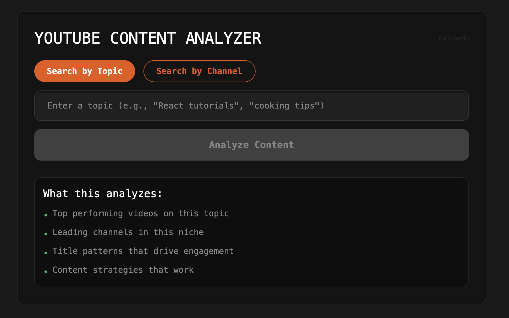
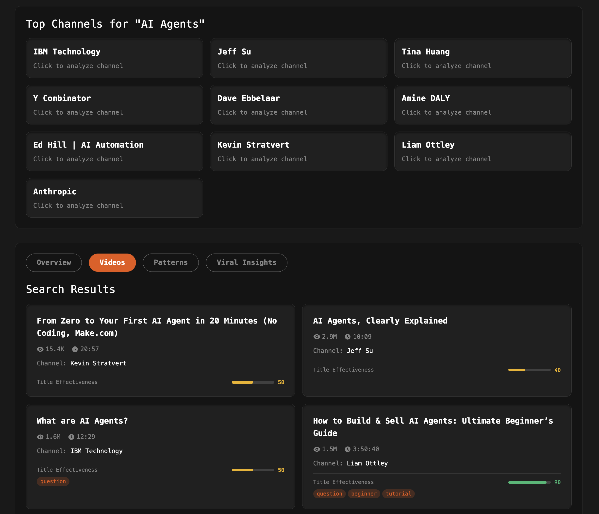

# YouTube Content Analyzer v3.0 🚀

A powerful tool to analyze YouTube channels and content patterns using yt-dlp and AI-powered NLP analysis. No YouTube API key required!





## 🎉 What's New in v3.0

### Enhanced Viral Insights with Actionable Takeaways
- **Hook Analysis**: Concrete explanations of why hooks work with psychological insights
- **Title Performance**: Full titles with performance insights and success factors
- **Content Templates**: Ready-to-use, copy-paste templates with fill-in-the-blanks
- **Viral Recipes**: Real-world examples with emotional triggers and expected CTR
- **Quick Wins**: Specific tips with examples and measurable impact metrics

## Features

### 🔍 Search & Discovery
- **Topic Search**: Find top-performing videos and channels for any topic
- **Channel Search**: Analyze specific channels by name or URL
- **Pattern Detection**: Identify successful content patterns across videos

### 📊 Content Analysis
- **Title Effectiveness**: Score titles based on engagement patterns
- **SEO Optimization**: Analyze descriptions for search optimization
- **Sentiment Analysis**: Understand audience reactions through comments
- **Engagement Prediction**: Predict video performance based on content structure

### 🚀 Viral Insights (v3.0)
- **Hook Effectiveness Score**: 2-decimal precision scoring with psychological explanations
- **Performance Insights**: Understand why titles work with specific CTR impact data
- **Content Templates Library**: 6 proven templates with fill-in-the-blanks format
- **Viral Content Recipes**: 5 detailed formulas with real examples and emotional triggers
- **Quick Implementation Wins**: Actionable tips with before/after examples and metrics

### 📈 Visualizations
- **Performance Metrics**: View engagement scores and trends
- **Pattern Charts**: Visualize common title patterns and topics
- **Channel Comparisons**: Compare multiple channels side-by-side

## Tech Stack

### Backend
- **FastAPI**: High-performance Python web framework
- **yt-dlp**: YouTube data extraction without API limits
- **Sentence-BERT**: Semantic similarity analysis
- **VADER**: Sentiment analysis
- **spaCy**: Natural language processing

### Frontend
- **React + TypeScript**: Type-safe component architecture
- **Vite**: Lightning-fast development server
- **D3.js**: Advanced data visualizations
- **Tailwind CSS**: Modern dark theme with glassmorphism

## Quick Start

### Prerequisites
- Python 3.8+
- Node.js 16+
- ffmpeg (optional, for enhanced yt-dlp features)

### Installation & Launch

```bash
# Clone or navigate to the project
cd youtube-content-analyzer

# Make the launch script executable
chmod +x start.sh

# Start both backend and frontend
./start.sh
```

The app will automatically:
1. Create Python virtual environment
2. Install all dependencies
3. Download required NLP models
4. Start backend on http://localhost:8012
5. Start frontend on http://localhost:3025
6. Open your browser

## Usage

### Analyzing a Topic
1. Select "Search by Topic"
2. Enter a topic (e.g., "React tutorials", "cooking tips")
3. Click "Analyze Content"
4. View top videos, channels, and patterns

### Analyzing a Channel
1. Select "Search by Channel"
2. Enter channel name or paste YouTube channel URL
3. Click "Analyze Content"
4. Explore channel metrics, top videos, and content patterns

### Understanding the Viral Insights (v3.0)

#### Content Templates Examples
- **Curiosity Gap**: "Why _______ is _______" 
  - Example: "Why Sleeping Less Makes You More Productive"
- **Number List**: "__ _______ That _______"
  - Example: "7 Morning Habits That Changed My Life"
- **Transformation**: "I _______ for _______ - Here's What Happened"
  - Example: "I Cold Called 100 CEOs - Here's What Happened"

#### Viral Recipe Examples
- **The Curiosity Loop**: Question Hook + Information Gap + Promise
  - Real Example: "Why do millionaires wake up at 4 AM? It's not what you think..."
  - Expected CTR: 8-12% (2x average)
- **The Sacred Cow Slayer**: Popular Belief + Counter + Evidence
  - Real Example: "Following your passion is terrible advice - Here's what 1000 entrepreneurs did instead"
  - Expected CTR: 10-15% (2.5x average)

### Understanding the Analysis

#### Title Effectiveness Score (0-100)
- **80-100**: Excellent - Uses proven patterns
- **60-79**: Good - Some optimization opportunities
- **40-59**: Average - Needs improvement
- **0-39**: Poor - Significant changes recommended

#### Engagement Prediction
- Based on title structure, description SEO, and historical patterns
- Factors include: power words, optimal length, CTAs, timestamps

#### Pattern Detection
- **Question**: Titles starting with how/what/why
- **Number List**: "5 Tips", "10 Ways", etc.
- **Tutorial**: How-to and guide content
- **Emotional**: Uses emotional triggers

## API Endpoints

### Backend API Documentation
Visit http://localhost:8012/docs for interactive API documentation

### Main Endpoints
- `POST /api/search` - Search for content
- `POST /api/channel/analyze` - Analyze a channel
- `POST /api/video/analyze` - Analyze a single video
- `POST /api/patterns/detect` - Detect patterns across videos

## Configuration

### Ports
- Frontend: 3025
- Backend: 8012

### Cache Settings
- Default cache TTL: 1 hour
- Stored in memory (Redis recommended for production)

## Limitations

- Analysis speed depends on number of videos
- Comments analysis may be limited by yt-dlp
- Some metrics may not be available for all videos
- YouTube structure changes may affect extraction

## Development

### Backend Development
```bash
cd backend
source venv/bin/activate
python app.py
```

### Frontend Development
```bash
cd frontend
npm run dev
```

## Troubleshooting

### Port Already in Use
The launch script automatically kills existing processes on ports 8012 and 3025

### Missing Dependencies
```bash
# Backend
cd backend && pip install -r requirements.txt

# Frontend
cd frontend && npm install
```

### yt-dlp Issues
```bash
# Update yt-dlp
pip install --upgrade yt-dlp
```

## License

MIT

## Credits

- Built with yt-dlp for YouTube data extraction
- UI design using FalconHQ design system
- Powered by open-source NLP models